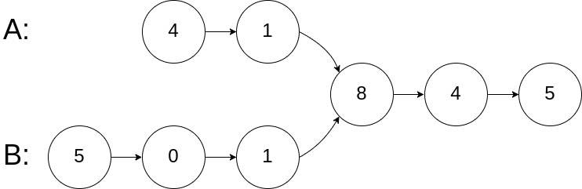

# Hot100
# 哈希
哈希表，也叫散列表，是一种基于“键-值”（Key-Value）对存储数据的数据结构。
哈希集合是只存储“键”（Key）而不存储“值”（Value）的特殊哈希表。它的核心特性是元素唯一和无序。
| 特性 | 哈希表 (Hash Table) | 哈希集合 (Hash Set) |
| :--- | :--- | :--- |
| 存储内容 | 键-值对 (Key-Value) | 唯一的键 (Key) |
| 核心优势 | 快速查找、插入、删除 | 保证元素唯一性、快速成员检查 |
| 典型应用 | 字典、缓存、映射关系 | 去重、成员资格判断 |
| 代码示例 | Python `dict`, Java `HashMap` | Python `set`, Java `HashSet` |

### 49.字母异位词分组
给你一个字符串数组，请你将 字母异位词 组合在一起。可以按任意顺序返回结果列表。
**示例1：** 
输入：strs = ["eat", "tea", "tan", "ate", "nat", "bat"]
输出: \[["bat"],["nat","tan"],["ate","eat","tea"]]
解释：在 `strs` 中没有字符串可以通过重新排列来形成 `bat`。字符串 `nat` 和 `tan` 是字母异位词，因为它们可以重新排列以形成彼此。字符串 `ate` ，`eat` 和 `tea` 是字母异位词，因为它们可以重新排列以形成彼此
**示例 2:**
输入: strs = [""]
输出: \[[""]]
**示例 3:**
输入: strs = ["a"]
输出: \[["a"]]

``` python
class Solution:
    def groupAnagrams(self, strs: List[str]) -> List[List[str]]:
        d = defaultdict(list)
        for s in strs:
            sorted_s = ''.join(sorted(s))
            d[sorted_s].append(s)
        return list(d.values())
``` 
**知识点：**
字符串列表转字符串：`'ab'=''.join(['a','b'])`
提取字典的值：`d.values()`，返回特定类型需强制转换

### 128.最长连续序列
给定一个未排序的整数数组`nums` ，找出数字连续的最长序列（不要求序列元素在原数组中连续）的长度。请你设计并实现时间复杂度为 $O(n)$ 的算法解决此问题。
**示例1**：
输入：nums = [100,4,200,1,3,2]
输出：4
解释：最长数字连续序列是 [1, 2, 3, 4]。它的长度为 4。
**示例2**：
输入：nums = [0,3,7,2,5,8,4,6,0,1]
输出：9

知识点:不能排序，排序的时间复杂度是$O(nlogn)$
``` python
class Solution:
    def longestConsecutive(self, nums: List[int]) -> int:
        st = set(nums)  # 把 nums 转成哈希集合
        ans = 0
        for x in st:  # 遍历哈希集合
            if x - 1 in st:  # 如果 x 不是序列的起点，直接跳过
                continue
            # x 是序列的起点
            y = x + 1
            while y in st:  # 不断查找下一个数是否在哈希集合中
                y += 1
            # 循环结束后，y-1 是最后一个在哈希集合中的数
            ans = max(ans, y - x)  # 从 x 到 y-1 一共 y-x 个数
            # 优化，ans不可能更大
            if ans * 2 >= m
                break
        return ans
```
## 双指针
### 283.移动零
给定一个数组 nums，编写一个函数将所有0移动到数组的末尾，同时保持非零元素的相对顺序。
请注意，必须在不复制数组的情况下原地对数组进行操作。
**示例 1:**
输入: nums = [0,1,0,3,12] 输出: [1,3,12,0,0]
**示例 2:**
输入: nums = [0] 输出: [0]
```python
class Solution:
    def moveZeroes(self, nums: List[int]) -> None:
        stack_size = 0
        for x in nums:
            if x:
                nums[stack_size] = x  # 把 x 入栈
                stack_size += 1
        for i in range(stack_size, len(nums)):
            nums[i] = 0
```

## 滑动窗口

## 子串
### 560. 和为k的子数组
> 需要复习

给你一个整数数组 nums 和一个整数 k ，请你统计并返回 该数组中和为 k 的子数组的个数。子数组是数组中元素的连续非空序列。
**示例 1：**
输入：nums = [1,1,1], k = 2 输出：2
**示例 2：**
输入：nums = [1,2,3], k = 3 输出：2
思路：转化为针对前缀和数组的两数之和问题，然后用哈希表
```python
class Solution:
    def subarraySum(self, nums: List[int], k: int) -> int:
        presum = [0]*(len(nums)+1)
        for i in range(1,len(nums)+1):
            presum[i] = presum[i-1]+nums[i-1]
        # if some i, j exist so that presum[i] - presum[j] = k then ans+=1
        # presum[j] = presum[i] - k
        ans = 0
        st = dict()
        for i in range(len(presum)):
            target = presum[i] - k
            if target in st:
                ans += st[target]
            st[presum[i]] = st.get(presum[i], 0) + 1
            

        return ans
```
知识点：
`st.get(key, default)`:第一个是查找的key，如果找不到不会报错，而是返回default

## 普通数组

## 矩阵

## 链表

### 160.相交链表
给你两个单链表的头节点`headA`和`headB`，请你找出并返回两个单链表相交的起始节点。如果两个链表不存在相交节点，返回`null`。
题目数据保证整个链式结构中不存在环。
注意，函数返回结果后，链表必须保持其原始结构 。
自定义评测：
评测系统 的输入如下（你设计的程序 不适用 此输入）：
`intersectVal` - 相交的起始节点的值。如果不存在相交节点，这一值为 0
`listA` - 第一个链表
`listB` - 第二个链表
`skipA` - 在 `listA` 中（从头节点开始）跳到交叉节点的节点数
`skipB` - 在 `listB` 中（从头节点开始）跳到交叉节点的节点数
评测系统将根据这些输入创建链式数据结构，并将两个头节点 `headA` 和 `headB` 传递给你的程序。如果程序能够正确返回相交节点，那么你的解决方案将被 视作正确答案 。
**示例 1：**

输入：intersectVal = 8, listA = [4,1,8,4,5], listB = [5,6,1,8,4,5], skipA = 2, skipB = 3
输出：Intersected at '8'
解释：相交节点的值为 8 （注意，如果两个链表相交则不能为 0）。
从各自的表头开始算起，链表 A 为 [4,1,8,4,5]，链表 B 为 [5,6,1,8,4,5]。
在 A 中，相交节点前有 2 个节点；在 B 中，相交节点前有 3 个节点。
— 请注意相交节点的值不为 1，因为在链表 A 和链表 B 之中值为 1 的节点 (A 中第二个节点和 B 中第三个节点) 是不同的节点。换句话说，它们在内存中指向两个不同的位置，而链表 A 和链表 B 中值为 8 的节点 (A 中第三个节点，B 中第四个节点) 在内存中指向相同的位置。
``` python
class Solution:
    def getIntersectionNode(self, headA: ListNode, headB: ListNode) -> ListNode:
        # 1. 边界情况：如果任一链表为空，不可能相交
        if not headA or not headB:
            return None
        
        # 2. 初始化双指针
        pA, pB = headA, headB
        
        # 3. 只要两个指针不相等，就一直走
        # 注意：如果相交，会在节点相遇；如果不相交，会在 null 相遇
        while pA != pB:
            # 如果 pA 走到头了，就跳到 B 的头；否则继续走下一步
            pA = pA.next if pA else headB
            
            # 如果 pB 走到头了，就跳到 A 的头；否则继续走下一步
            pB = pB.next if pB else headA
            
        # 4. 返回相遇点（可能是相交节点，也可能是 null）
        return pA
```

## 二叉树


## 图论

## 回溯

## 二分查找

## 栈

## 堆

## 贪心算法

## 动态规划
### 70.爬楼梯
假设你正在爬楼梯。需要n阶你才能到达楼顶。
每次你可以爬1或2个台阶。你有多少种不同的方法可以爬到楼顶呢？
```python
class Solution:
    def climbStairs(self, n: int) -> int:
        if n <= 2:
            return n
        dp = [0] * n
        dp[0] = 1
        dp[1] = 2
        for i in range(2,n):
            dp[i] = dp[i-2] + dp[i-1]
        return dp[n-1]
```

### 118.杨辉三角
给定一个非负整数 numRows，生成「杨辉三角」的前 numRows 行。
在「杨辉三角」中，每个数是它左上方和右上方的数的和。
**示例 1:**
输入: numRows = 5
输出: \[[1],[1,1],[1,2,1],[1,3,3,1],[1,4,6,4,1]]
**示例 2:**
输入: numRows = 1
输出: [[1]]
```python
class Solution:
    def generate(self, numRows: int) -> List[List[int]]:
        dp = list()
        for i in range(numRows):
            row = list()
            for j in range(0, i+1):
                if j == 0 or j == i:
                    row.append(1)
                else:
                    row.append(dp[i-1][j]+dp[i-1][j-1])
            dp.append(row)
        return dp
```


## 多维DP

## 技巧
### 136.只出现一次的数字
给你一个非空整数数组`nums`，除了某个元素只出现一次以外，其余每个元素均出现两次。找出那个只出现了一次的元素。
你必须设计并实现线性时间复杂度的算法来解决此问题，且该算法只使用常量额外空间。
**示例 1 ：**
输入：nums = [2,2,1] 输出：1
输入：nums = [4,1,2,1,2] 输出：4
``` python
class Solution:
    def singleNumber(self, nums: List[int]) -> List[int]:
        x = 0
        for num in nums:  # 1. 遍历 nums 执行异或运算
            x ^= num      
        return x;         # 2. 返回出现一次的数字 x

```
知识点：相同为0, 不同为1，用异或

### 169.多数元素
给定一个大小为`n`的数组`nums`，返回其中的多数元素。多数元素是指在数组中出现次数 大于`⌊ n/2 ⌋`的元素。
你可以假设数组是非空的，并且给定的数组总是存在多数元素。
**示例 1：**
输入：nums = [3,2,3] 输出：3
输入：nums = [2,2,1,1,1,2,2] 输出：2
``` python
class Solution:
    def majorityElement(self, nums: List[int]) -> int:
        votes = 0
        for num in nums:
            if votes == 0: x = num
            votes += 1 if num == x else -1
        return x

```

### 75.颜色分类
给定一个包含红色、白色和蓝色、共`n`个元素的数组`nums`，原地对它们进行排序，使得相同颜色的元素相邻，并按照红色、白色、蓝色顺序排列。
我们使用整数 0、 1 和 2 分别表示红色、白色和蓝色。
必须在不使用库内置的`sort`函数的情况下解决这个问题。
**示例 1：**
输入：nums = [2,0,2,1,1,0] 输出：[0,0,1,1,2,2]
``` python
class Solution:
    def sortColors(self, nums: List[int]) -> None:
        """
        Do not return anything, modify nums in-place instead.
        """
        x = 0
        n = len(nums)
        for i in range(n):
            x and num[i]
```