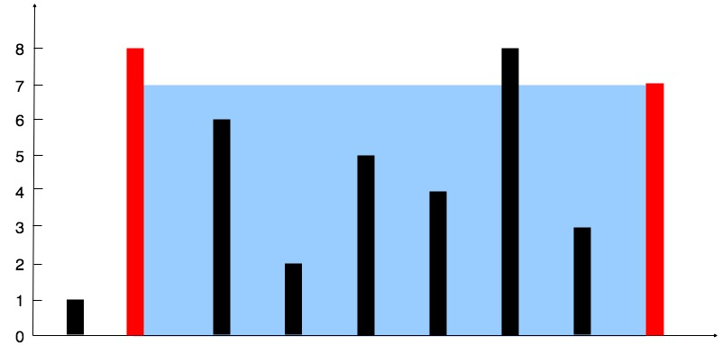
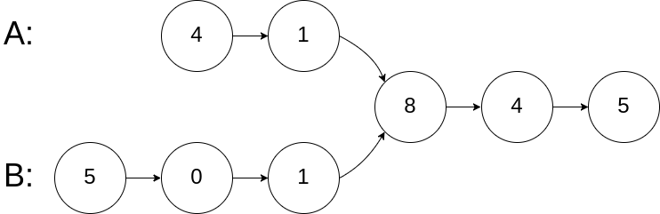
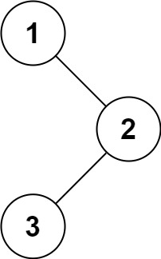
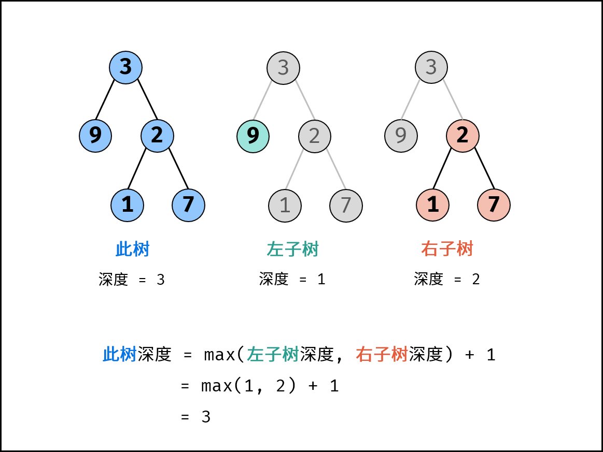
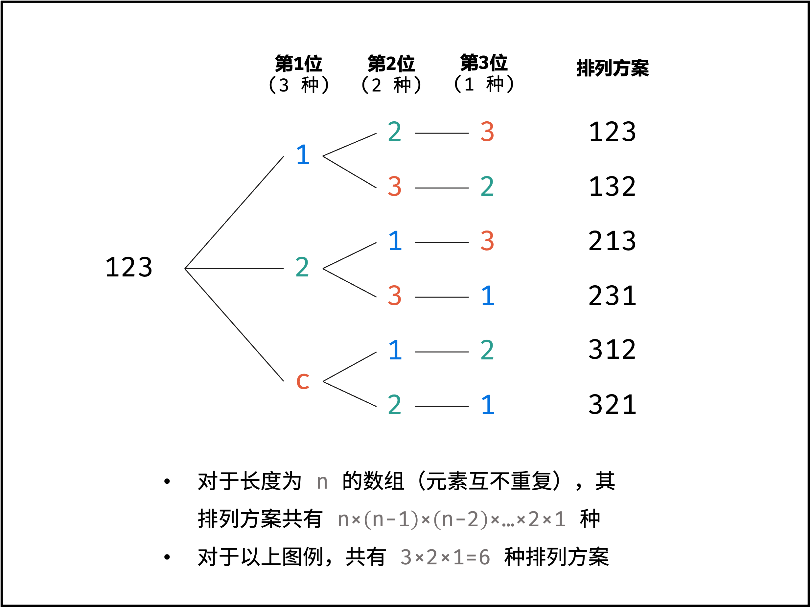

# Hot100
## 哈希
哈希表，也叫散列表，是一种基于“键-值”（Key-Value）对存储数据的数据结构。
哈希集合是只存储“键”（Key）而不存储“值”（Value）的特殊哈希表。它的核心特性是元素唯一和无序。
| 特性 | 哈希表 (Hash Table) | 哈希集合 (Hash Set) |
| :--- | :--- | :--- |
| 存储内容 | 键-值对 (Key-Value) | 唯一的键 (Key) |
| 核心优势 | 快速查找、插入、删除 | 保证元素唯一性、快速成员检查 |
| 典型应用 | 字典、缓存、映射关系 | 去重、成员资格判断 |
| 代码示例 | Python `dict`, Java `HashMap` | Python `set`, Java `HashSet` |
### 1.两数之和

### 49.字母异位词分组
给你一个字符串数组，请你将 字母异位词 组合在一起。可以按任意顺序返回结果列表。
**示例1：** 
输入：strs = ["eat", "tea", "tan", "ate", "nat", "bat"]
输出: \[["bat"],["nat","tan"],["ate","eat","tea"]]
解释：在 `strs` 中没有字符串可以通过重新排列来形成 `bat`。字符串 `nat` 和 `tan` 是字母异位词，因为它们可以重新排列以形成彼此。字符串 `ate` ，`eat` 和 `tea` 是字母异位词，因为它们可以重新排列以形成彼此
**示例 2：**
输入: strs = [""]
输出: \[[""]]
**示例 3：**
输入: strs = ["a"]
输出: \[["a"]]

``` python
class Solution:
    def groupAnagrams(self, strs: List[str]) -> List[List[str]]:
        d = defaultdict(list)
        for s in strs:
            sorted_s = ''.join(sorted(s))
            d[sorted_s].append(s)
        return list(d.values())
``` 
**知识点：**
字符串列表转字符串：`'ab'=''.join(['a','b'])`
提取字典的值：`d.values()`，返回特定类型需强制转换

### 128.最长连续序列
给定一个未排序的整数数组`nums` ，找出数字连续的最长序列（不要求序列元素在原数组中连续）的长度。请你设计并实现时间复杂度为 $O(n)$ 的算法解决此问题。
**示例1**：
输入：nums = [100,4,200,1,3,2]
输出：4
解释：最长数字连续序列是 [1, 2, 3, 4]。它的长度为 4。
**示例2**：
输入：nums = [0,3,7,2,5,8,4,6,0,1]
输出：9

知识点:不能排序，排序的时间复杂度是$O(nlogn)$
``` python
class Solution:
    def longestConsecutive(self, nums: List[int]) -> int:
        st = set(nums)  # 把 nums 转成哈希集合
        ans = 0
        for x in st:  # 遍历哈希集合
            if x - 1 in st:  # 如果 x 不是序列的起点，直接跳过
                continue
            # x 是序列的起点
            y = x + 1
            while y in st:  # 不断查找下一个数是否在哈希集合中
                y += 1
            # 循环结束后，y-1 是最后一个在哈希集合中的数
            ans = max(ans, y - x)  # 从 x 到 y-1 一共 y-x 个数
            # 优化，ans不可能更大
            if ans * 2 >= m
                break
        return ans
```
## 双指针
### 283.移动零
给定一个数组 nums，编写一个函数将所有0移动到数组的末尾，同时保持非零元素的相对顺序。
请注意，必须在不复制数组的情况下原地对数组进行操作。
**示例 1：**
输入: nums = [0,1,0,3,12] 输出: [1,3,12,0,0]
**示例 2：**
输入: nums = [0] 输出: [0]
```python
class Solution:
    def moveZeroes(self, nums: List[int]) -> None:
        stack_size = 0
        for x in nums:
            if x:
                nums[stack_size] = x  # 把 x 入栈
                stack_size += 1
        for i in range(stack_size, len(nums)):
            nums[i] = 0
```

### 11.盛最多水的容器
给定一个长度为 n 的整数数组 height 。有 n 条垂线，第 i 条线的两个端点是 (i, 0) 和 (i, height[i]) 。
找出其中的两条线，使得它们与 x 轴共同构成的容器可以容纳最多的水。
返回容器可以储存的最大水量。
说明：你不能倾斜容器。

示例1
输入：[1,8,6,2,5,4,8,3,7]
输出：49 
解释：图中垂直线代表输入数组 [1,8,6,2,5,4,8,3,7]。在此情况下，容器能够容纳水（表示为蓝色部分）的最大值为 49。
示例 2：

输入：height = [1,1]
输出：1
## 滑动窗口
### 3.无重复字符的最长子串
给定一个字符串s，请你找出其中不含有重复字符的最长子串的长度。


## 子串
### 560. 和为k的子数组
> 需要复习

给你一个整数数组 nums 和一个整数 k ，请你统计并返回 该数组中和为 k 的子数组的个数。子数组是数组中元素的连续非空序列。
**示例 1：**
输入：nums = [1,1,1], k = 2 输出：2
**示例 2：**
输入：nums = [1,2,3], k = 3 输出：2
思路：转化为针对前缀和数组的两数之和问题，然后用哈希表
```python
class Solution:
    def subarraySum(self, nums: List[int], k: int) -> int:
        presum = [0]*(len(nums)+1)
        for i in range(1,len(nums)+1):
            presum[i] = presum[i-1]+nums[i-1]
        # if some i, j exist so that presum[i] - presum[j] = k then ans+=1
        # presum[j] = presum[i] - k
        ans = 0
        st = dict()
        for i in range(len(presum)):
            target = presum[i] - k
            if target in st:
                ans += st[target]
            st[presum[i]] = st.get(presum[i], 0) + 1
            

        return ans
```
知识点：
`st.get(key, default)`:第一个是查找的key，如果找不到不会报错，而是返回default

## 普通数组

## 矩阵

## 链表
### 160.相交链表
给你两个单链表的头节点`headA`和`headB`，请你找出并返回两个单链表相交的起始节点。如果两个链表不存在相交节点，返回`null`。
题目数据保证整个链式结构中不存在环。
注意，函数返回结果后，链表必须保持其原始结构 。
自定义评测：
评测系统 的输入如下（你设计的程序 不适用 此输入）：
`intersectVal` - 相交的起始节点的值。如果不存在相交节点，这一值为 0
`listA` - 第一个链表
`listB` - 第二个链表
`skipA` - 在 `listA` 中（从头节点开始）跳到交叉节点的节点数
`skipB` - 在 `listB` 中（从头节点开始）跳到交叉节点的节点数
评测系统将根据这些输入创建链式数据结构，并将两个头节点 `headA` 和 `headB` 传递给你的程序。如果程序能够正确返回相交节点，那么你的解决方案将被 视作正确答案 。
**示例 1：**

输入：intersectVal = 8, listA = [4,1,8,4,5], listB = [5,6,1,8,4,5], skipA = 2, skipB = 3
输出：Intersected at '8'
解释：相交节点的值为 8 （注意，如果两个链表相交则不能为 0）。
从各自的表头开始算起，链表 A 为 [4,1,8,4,5]，链表 B 为 [5,6,1,8,4,5]。
在 A 中，相交节点前有 2 个节点；在 B 中，相交节点前有 3 个节点。
— 请注意相交节点的值不为 1，因为在链表 A 和链表 B 之中值为 1 的节点 (A 中第二个节点和 B 中第三个节点) 是不同的节点。换句话说，它们在内存中指向两个不同的位置，而链表 A 和链表 B 中值为 8 的节点 (A 中第三个节点，B 中第四个节点) 在内存中指向相同的位置。
``` python
class Solution:
    def getIntersectionNode(self, headA: ListNode, headB: ListNode) -> ListNode:
        # 1. 边界情况：如果任一链表为空，不可能相交
        if not headA or not headB:
            return None
        
        # 2. 初始化双指针
        pA, pB = headA, headB
        
        # 3. 只要两个指针不相等，就一直走
        # 注意：如果相交，会在节点相遇；如果不相交，会在 null 相遇
        while pA != pB:
            # 如果 pA 走到头了，就跳到 B 的头；否则继续走下一步
            pA = pA.next if pA else headB
            
            # 如果 pB 走到头了，就跳到 A 的头；否则继续走下一步
            pB = pB.next if pB else headA
            
        # 4. 返回相遇点（可能是相交节点，也可能是 null）
        return pA
```

### 206.反转链表
给你单链表的头节点`head`，请你反转链表，并返回反转后的链表。
**示例1：**

输入：head = [1,2,3,4,5]
输出：[5,4,3,2,1]
**示例2：**

输入：head = [1,2]
输出：[2,1]
**示例3：**
输入：head = []
输出：[]
```python
# Definition for singly-linked list.
# class ListNode:
#     def __init__(self, val=0, next=None):
#         self.val = val
#         self.next = next
class Solution:
    def reverseList(self, head: Optional[ListNode]) -> Optional[ListNode]:
        cur, pre = head, None
        while cur:
            tmp = cur.next # 暂存后继节点 cur.next
            cur.next = pre # 修改 next 引用指向
            pre = cur # pre 暂存 cur
            cur = tmp # cur 访问下一节点
        return pre
```

## 二叉树
### 94.二叉树的中序遍历
给定一个二叉树的根节点`root`，返回它的中序遍历 。
**示例1：**

输入：root = [1,null,2,3]
输出：[1,3,2]
**示例2：**
输入：root = []
输出：[]
**示例3：**
输入：root = [1]
输出：[1]

**思路1：**
递归实现
- 前序遍历：打印 - 左 - 右
- 中序遍历：左 - 打印 - 右
- 后序遍历：左 - 右 - 打印
按照 左-打印-右这种顺序遍历树,终止条件：当前节点为空时
函数内：递归的调用左节点，打印当前节点，再递归调用右节点
``` python
class Solution(object):
	def inorderTraversal(self, root):
		"""
		:type root: TreeNode
		:rtype: List[int]
		"""
		res = []
		def dfs(root):
			if not root:
				return
			# 按照 左-打印-右的方式遍历	
			dfs(root.left)
			res.append(root.val)
			dfs(root.right)
		dfs(root)
		return res
```

### 104.二叉树的最大深度
给定一个二叉树`root`，返回其最大深度。二叉树的最大深度是指从根节点到最远叶子节点的最长路径上的节点数。
**示例1：**

输入：root = [3,9,20,null,null,15,7]
输出：3
**示例2：**
输入：root = [1,null,2]
输出：2
**思路：** 树的遍历方式总体分为两类：深度优先搜索（DFS）、广度优先搜索（BFS）。
- 常见 DFS ： 先序遍历、中序遍历、后序遍历。
- 常见 BFS ： 层序遍历（即按层遍历）。

**方法1 后序遍历(DFS)**
树的后序遍历 / 深度优先搜索往往利用递归或栈实现
1.终止条件：当`root`为空，说明已经越过了叶节点，返回0
2.递归工作：本质上是对树做后序遍历
a.计算节点`root`的左子树深度，调用maxDepth(root.left)
b.计算节点`root`的右子树深度，调用maxDepth(root.right)
3.返回`max(maxDepth(root.left), maxDepth(root.right)) + 1`
```python
# Definition for a binary tree node.
# class TreeNode:
#     def __init__(self, val=0, left=None, right=None):
#         self.val = val
#         self.left = left
#         self.right = right
class Solution:
    def maxDepth(self, root: Optional[TreeNode]) -> int:
        if not root: return 0
        return max(self.maxDepth(root.left), self.maxDepth(root.right)) + 1
```
**方法2 层级遍历(BFS)**
树的层序遍历 / 广度优先搜索往往利用队列实现。
```python
class Solution:
    def maxDepth(self, root: Optional[TreeNode]) -> int:
        if not root: return 0
        queue, res = [root], 0
        while queue:
            tmp = []
            for node in queue:
                if node.left: tmp.append(node.left)
                if node.right: tmp.append(node.right)
            queue = tmp
            res += 1
        return res

```


## 图论
### 200.岛屿数量
给你一个由`1`（陆地）和`0`（水）组成的的二维网格，请你计算网格中岛屿的数量。
岛屿总是被水包围，并且每座岛屿只能由水平方向和/或竖直方向上相邻的陆地连接形成。
此外，你可以假设该网格的四条边均被水包围。
**示例 1：**
输入：grid = [
  ['1','1','1','1','0'],
  ['1','1','0','1','0'],
  ['1','1','0','0','0'],
  ['0','0','0','0','0']
]
输出：1

**示例 2：**
输入：grid = [
  ['1','1','0','0','0'],
  ['1','1','0','0','0'],
  ['0','0','1','0','0'],
  ['0','0','0','1','1']
]
输出：3

**思路1：** 深度优先搜索
- 目标是找到矩阵中 “岛屿的数量” ，上下左右相连的 1 都被认为是连续岛屿。
- dfs方法: 设目前指针指向一个岛屿中的某一点 (i, j)，寻找包括此点的岛屿边界。
  - 从 (i, j) 向此点的上下左右 (i+1,j),(i-1,j),(i,j+1),(i,j-1) 做深度搜索。
  - 终止条件：1. (i, j) 越过矩阵边界; 2. grid[i][j] == 0，代表此分支已越过岛屿边界。
  - 搜索岛屿的同时，执行 grid[i][j] = '0'，即将岛屿所有节点删除，以免之后重复搜索相同岛屿。
- 主循环：
  - 遍历整个矩阵，当遇到 grid[i][j] == '1' 时，从此点开始做深度优先搜索 dfs，岛屿数`count + 1` 且在深度优先搜索中删除此岛屿。
- 最终返回岛屿数`count`即可。
```python
class Solution:
    def numIslands(self, grid: List[List[str]]) -> int:
        m = len(grid)
        n = len(grid[0])
        def dfs(grid, i, j):
            if not 0 <= i < m or not 0 <= j < n or grid[i][j] == '0': return
            grid[i][j]='0'
            dfs(grid, i+1, j)
            dfs(grid, i, j+1)
            dfs(grid, i-1, j)
            dfs(grid, i, j-1)
        count = 0
        for i in range(m):
            for j in range(n):
                if grid[i][j] == '1':
                    dfs(grid, i, j)
                    count += 1
        return count
```
**思路2：**
- 主循环和思路一类似，不同点是在于搜索某岛屿边界的方法不同。
- bfs 方法：
  - 借用一个队列 queue，判断队列首部节点 (i, j) 是否未越界且为 1：
    - 若是则置零（删除岛屿节点），并将此节点上下左右节点 (i+1,j),(i-1,j),(i,j+1),(i,j-1) 加入队列；
    - 若不是则跳过此节点；
  - 循环`pop`队列首节点，直到整个队列为空，此时已经遍历完此岛屿。
``` python
class Solution:
    def numIslands(self, grid: List[List[str]]) -> int:
        def bfs(grid, i, j):
            queue = [[i, j]]
            while queue:
                [i, j] = queue.pop(0)
                if 0 <= i < len(grid) and 0 <= j < len(grid[0]) and grid[i][j]=='1':
                    grid[i][j] = '0' 
                    queue += [[i + 1, j], [i - 1, j], [i, j - 1], [i, j + 1]]
        count = 0
        for i in range(len(grid)):
            for j in range(len(grid[0])):
                if grid[i][j] == '0': continue
                bfs(grid, i, j)
                count += 1
        return count

```

## 回溯
### 46.全排列
给定一个不含重复数字的数组`nums`，返回其所有可能的全排列。你可以按任意顺序返回答案。`nums`中的所有整数互不相同
**示例 1：**
输入：nums = [1,2,3]
输出：\[[1,2,3],[1,3,2],[2,1,3],[2,3,1],[3,1,2],[3,2,1]]
**示例 2：**
输入：nums = [0,1]
输出：\[[0,1],[1,0]]
**示例 3：**
输入：nums = [1]
输出：\[[1]]
**思路1：**
对于一个长度为n的数组（假设元素互不重复），其排列方案数共有：n×(n−1)×(n−2)…×2×1
**排列方案的生成：**
根据数组排列的特点，考虑深度优先搜索所有排列方案。即通过元素交换，先固定第 1 位元素（ n 种情况）、再固定第 2 位元素（ n−1 种情况）、... 、最后固定第 n 位元素（ 1 种情况）。

**递归解析：**
- 终止条件： 当 x = len(nums) - 1 时，代表所有位已固定（最后一位只有 1 种情况），则将当前组合 nums 转化为数组并加入 res ，并返回。
- 递推参数： 当前固定位 x 。
- 递推工作： 将第 x 位元素与 i ∈ [x, len(nums)] 元素分别交换，并进入下层递归。
  - 固定元素： 将元素 nums[i] 和 nums[x] 交换，即固定 nums[i] 为当前位元素。
  - 开启下层递归： 调用 dfs(x + 1) ，即开始固定第 x + 1 个元素。
  - 还原交换： 将元素 nums[i] 和 nums[x] 交换（还原之前的交换）。

```python
class Solution:
    def permute(self, nums: List[int]) -> List[List[int]]:
        def dfs(x):
            if x == len(nums) - 1:
                res.append(list(nums))   # 添加排列方案
                return
            for i in range(x, len(nums)):
                nums[i], nums[x] = nums[x], nums[i]  # 交换，将 nums[i] 固定在第 x 位
                dfs(x + 1)                           # 开启固定第 x + 1 位元素
                nums[i], nums[x] = nums[x], nums[i]  # 恢复交换
        res = []
        dfs(0)
        return res
```


## 二分查找

## 栈

## 堆

## 贪心算法


## 动态规划
### 70.爬楼梯
假设你正在爬楼梯。需要n阶你才能到达楼顶。
每次你可以爬1或2个台阶。你有多少种不同的方法可以爬到楼顶呢？
```python
class Solution:
    def climbStairs(self, n: int) -> int:
        if n <= 2:
            return n
        dp = [0] * n
        dp[0] = 1
        dp[1] = 2
        for i in range(2,n):
            dp[i] = dp[i-2] + dp[i-1]
        return dp[n-1]
```


### 118.杨辉三角
给定一个非负整数 numRows，生成「杨辉三角」的前 numRows 行。
在「杨辉三角」中，每个数是它左上方和右上方的数的和。
**示例 1：**
输入: numRows = 5
输出: \[[1],[1,1],[1,2,1],[1,3,3,1],[1,4,6,4,1]]
**示例 2：**
输入: numRows = 1
输出: [[1]]
```python
class Solution:
    def generate(self, numRows: int) -> List[List[int]]:
        dp = list()
        for i in range(numRows):
            row = list()
            for j in range(0, i+1):
                if j == 0 or j == i:
                    row.append(1)
                else:
                    row.append(dp[i-1][j]+dp[i-1][j-1])
            dp.append(row)
        return dp
```


## 多维DP
### 


## 技巧
### 136.只出现一次的数字
给你一个非空整数数组`nums`，除了某个元素只出现一次以外，其余每个元素均出现两次。找出那个只出现了一次的元素。
你必须设计并实现线性时间复杂度的算法来解决此问题，且该算法只使用常量额外空间。
**示例 1 ：**
输入：nums = [2,2,1] 输出：1
输入：nums = [4,1,2,1,2] 输出：4
``` python
class Solution:
    def singleNumber(self, nums: List[int]) -> List[int]:
        x = 0
        for num in nums:  # 1. 遍历 nums 执行异或运算
            x ^= num      
        return x;         # 2. 返回出现一次的数字 x

```
知识点：相同为0, 不同为1，用异或

### 169.多数元素
给定一个大小为`n`的数组`nums`，返回其中的多数元素。多数元素是指在数组中出现次数 大于`⌊ n/2 ⌋`的元素。
你可以假设数组是非空的，并且给定的数组总是存在多数元素。
**示例 1：**
输入：nums = [3,2,3] 输出：3
输入：nums = [2,2,1,1,1,2,2] 输出：2
``` python
class Solution:
    def majorityElement(self, nums: List[int]) -> int:
        votes = 0
        for num in nums:
            if votes == 0: x = num
            votes += 1 if num == x else -1
        return x

```

### 75.颜色分类
给定一个包含红色、白色和蓝色、共`n`个元素的数组 `nums`，原地 对它们进行排序，使得相同颜色的元素相邻，并按照红色、白色、蓝色顺序排列。
我们使用整数0、1和2分别表示红色、白色和蓝色。
必须在不使用库内置的`sort`函数的情况下解决这个问题。
```python
class Solution:
    def sortColors(self, nums: List[int]) -> None:
        """
        Do not return anything, modify nums in-place instead.
        """
        l, i, r = 0, 0, len(nums)-1
        while i <= r:
            if nums[i] == 0:
                nums[i], nums[l] = nums[l], nums[i]
                l += 1
                i += 1
            elif nums[i] == 2:
                nums[i], nums[r] = nums[r], nums[i]
                r -= 1
            else:
                i += 1

```

### 31.下一个排列
整数数组的一个排列就是将其所有成员以序列或线性顺序排列。
例如，`arr =[1,2,3]`，以下这些都可以视作`arr` 的排列：`[1,2,3]`、`[1,3,2]`、`[3,1,2]`、`[2,3,1]`。
整数数组的 下一个排列 是指其整数的下一个字典序更大的排列。更正式地，如果数组的所有排列根据其字典顺序从小到大排列在一个容器中，那么数组的 下一个排列 就是在这个有序容器中排在它后面的那个排列。如果不存在下一个更大的排列，那么这个数组必须重排为字典序最小的排列（即，其元素按升序排列）。
- 例如，`arr = [1,2,3]` 的下一个排列是 `[1,3,2]` 。
- 类似地，`arr = [2,3,1]` 的下一个排列是 `[3,1,2]` 。
- 而 `arr = [3,2,1]` 的下一个排列是 `[1,2,3]` ，因为 `[3,2,1]` 不存在一个字典序更大的排列。
- 给你一个整数数组 `nums` ，找出`nums` 的下一个排列。
- 必须原地修改，只允许使用额外常数空间。
