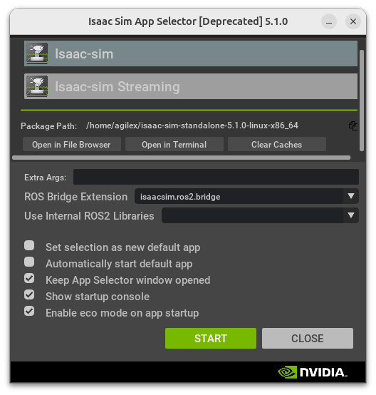
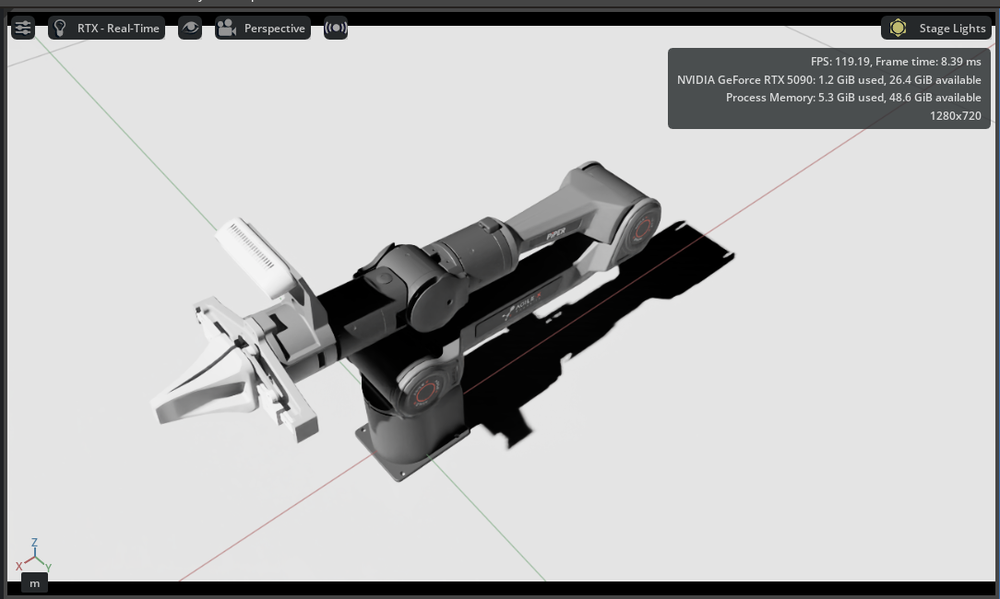

# Piper_isaac_sim

测试系统配置：ubuntu24.04+5090显卡

## 1、配置系统环境

### 1）安装显卡驱动

[下载链接](https://www.nvidia.com/Download/index.aspx)

### 2）下载NVIDIA Omniverse

[下载链接](https://www.nvidia.com/en-us/omniverse/)

### 3）下载isaac sim

[下载链接](https://docs.isaacsim.omniverse.nvidia.com/latest/installation/index.html)


### 4）启动isaac sim，导入USD

#### 下载代码

```
git clone https://github.com/agilexrobotics/piper_isaac_sim.git
```

#### 启动isaac sim



打开isaac sim之后，在content中找到存放USD的路径，双击打开



成功导入后，点击三角按钮开始仿真
